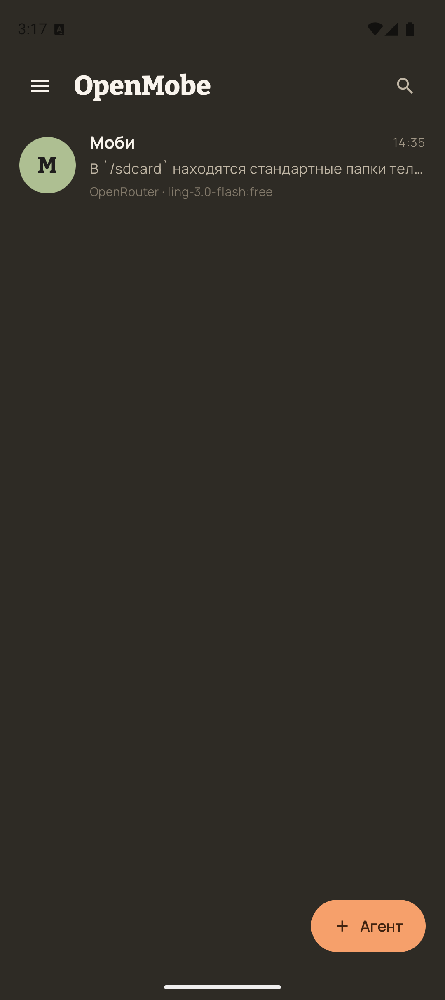
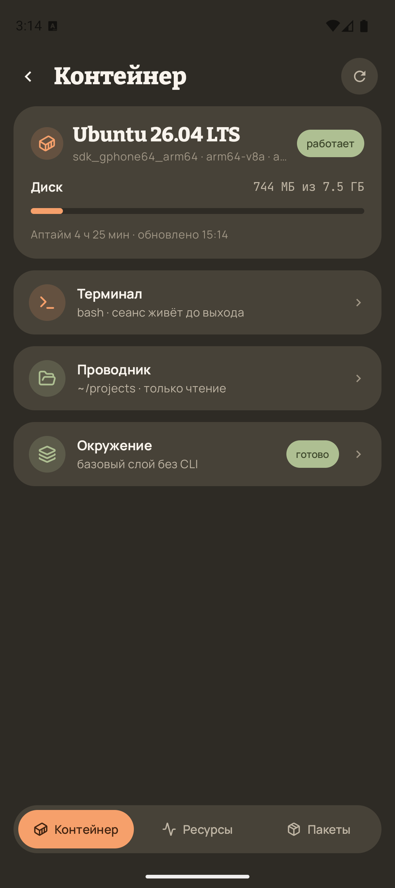
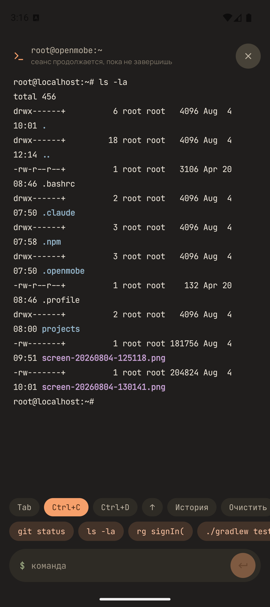
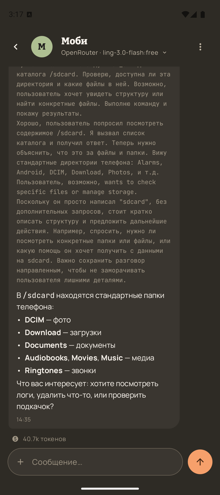
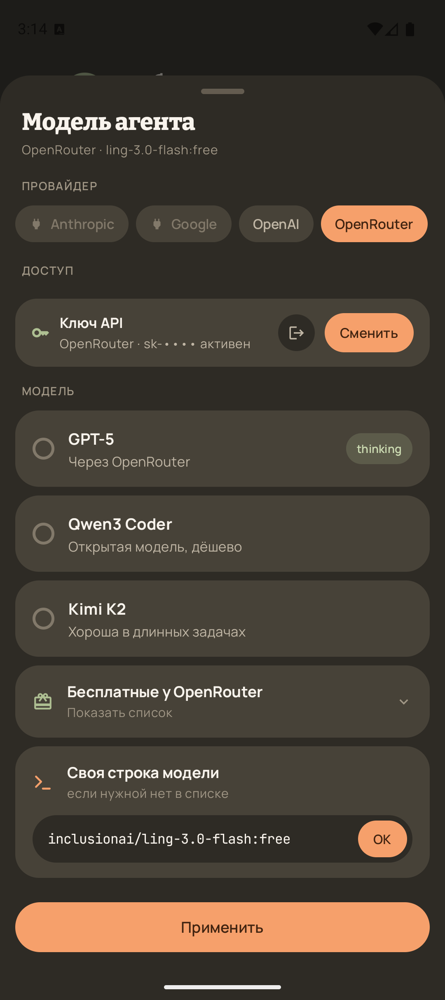
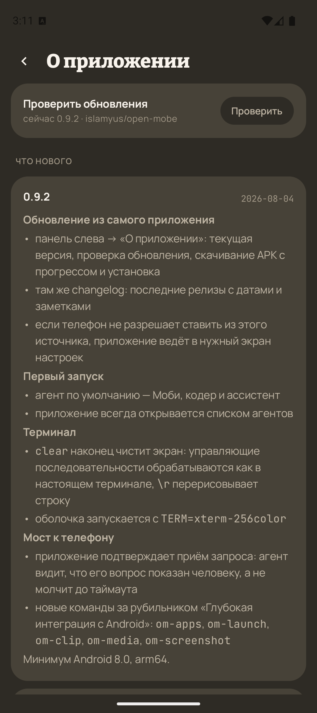

# OpenMobe

**Linux и ИИ-агент в кармане.**

Android-приложение, внутри которого работает полноценный контейнер Ubuntu и
живёт агент: он читает и правит файлы, ставит пакеты, запускает команды и
дотягивается до самого телефона — камеры, микрофона, уведомлений, экрана.

Ни root, ни компьютера рядом не нужно.

  
  
  

## Что умеет

**Несколько агентов.** У каждого своё имя, цвет, характер и права. Модель
выбирается отдельно для каждого: Anthropic, OpenAI, Google или OpenRouter —
по подписке или по ключу API. У OpenRouter список бесплатных моделей
подтягивается сам, так что начать можно даром.

**Настоящий Linux.** Ubuntu внутри приложения: терминал во весь экран с
историей команд, проводник по файлам, установка пакетов в пару нажатий. Всё,
что делает агент, происходит в контейнере — телефон остаётся нетронутым.

**Агент, который правда работает.** Не отвечает текстом «вот что нужно
сделать», а делает: клонирует репозиторий, ставит зависимости, запускает
сборку, читает логи, правит код. Долгие задачи идут в фоне и не обрываются,
когда экран гаснет.

**Связь с телефоном.** Снять фото, послушать и сказать вслух, прислать
уведомление, отправить файл в чат или наружу — в мессенджер и почту, найти
что-то в сети и прочитать страницу.

**Глубокая интеграция с Android** — по желанию, отдельным тумблером: список
установленных приложений и их запуск, буфер обмена, управление плеером и
громкостью, снимок экрана.

**Своя память.** Агент ведёт заметки и правила, по которым их пишет. Правила
можно поправить прямо в его профиле — и он начнёт помнить иначе. Память видна
в приложении, ничего не спрятано.

**Права под контролем.** Файлы, камера, микрофон и уведомления выдаются
каждому агенту отдельно, любой доступ выключается одним переключателем. Ключи
и токены остаются в контейнере на телефоне.

**Обновления из приложения.** Панель слева → «О приложении»: проверка новой
версии, что в ней изменилось, скачивание и установка — без магазинов.

  
  
  

## Установка

Скачайте APK из [релизов](https://github.com/islamyus/open-mobe/releases) и
откройте на телефоне. Android один раз спросит разрешение ставить приложения
из этого источника — так и должно быть при установке мимо магазина.

Дальше приложение обновляет себя само.

**Требования:** Android 8.0 и новее, arm64, около 2 ГБ свободного места под
контейнер.

## Обратная связь

Нашли ошибку или чего-то не хватает —
[issues](https://github.com/islamyus/open-mobe/issues).

---

© 2026 OpenMobe. Все права защищены.
